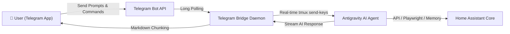

<p align="right">
  <a href="README.md">한국어</a> · <strong>English</strong>
</p>

<p align="center">
  
</p>

<h1 align="center">Antigravity for Home Assistant</h1>

<p align="center">
  All-in-one AI Assistant App integrating <strong>Google Antigravity AI CLI (<code>agy</code>)</strong> and <strong>Telegram Bot Messenger</strong><br>
  to control smart home devices, verify dashboards, build automations, and diagnose errors directly in Home Assistant.
</p>

<p align="center">
  <a href="https://github.com/Kanu-Coffee/antigravity-for-home-assistant/releases"></a>
  <a href="https://github.com/Kanu-Coffee/antigravity-for-home-assistant/actions/workflows/ci.yaml"></a>
  
  
  <a href="LICENSE"></a>
</p>

<p align="center">
  <a href="https://my.home-assistant.io/redirect/supervisor_add_addon_repository/?repository_url=https%3A%2F%2Fgithub.com%2FKanu-Coffee%2Fantigravity-for-home-assistant"></a>
</p>

---

## 🌟 Key Features

- 🤖 **Native Google Antigravity CLI (`agy`)**: Powered by Google DeepMind's Advanced Agentic Coding team.
- 📱 **Telegram Bot Mobile Remote Control**: Chat with Antigravity from your smartphone via 1-Click Deep Link, 6-digit PIN code, or manual Chat ID whitelist.
- 🧠 **`ha_memory` Persistent SQLite Memory DB (16 Tools)**: Memorizes room hierarchy, user preferences, device aliases, and automation rules across sessions.
- 🌐 **`playwright` UI & Dashboard Verification MCP (16 Tools)**: Headless Chromium browser automation inspecting Ingress web UI dashboards.
- 🛡️ **Home Assistant Safety Rules (`AGENTS.md`)**: Guardrails safeguarding `secrets.yaml`, `.storage`, and enforcing `ha-config-check` validations.
- ⚡ **Real-Time `tmux` Session Sync**: Seamless live context & authentication sharing between Web Terminal (`ttyd`) and Telegram Bot.

---

## 📱 Telegram Bot Mobile Setup Guide

Chat with Antigravity AI remotely from your phone or desktop via Telegram:



### Step 1: Obtain a Telegram Bot Token (Takes 10 Seconds)
1. In Telegram, search for **[@BotFather](https://t.me/botfather)** and start a chat (`/start`).
2. Type `/newbot` and choose a display name and username (ending in `bot`).
3. Copy the generated **HTTP API Token** (e.g. `123456789:ABCdefGhIJKlmNoPQRsTUVwxyZ`).

### Step 2: Configure Add-on Settings
1. Open Home Assistant ➔ **Settings ➔ Add-ons ➔ Antigravity for Home Assistant**.
2. Click the **Configuration** tab.
3. Set `telegram_enabled` to **`true`**.
4. Paste your token into `telegram_bot_token` ➔ **Save** and **Restart Add-on**.

### Step 3: Pair Instantly via 3 Flexible Methods

| Pairing Method | How to Pair | Recommended For |
|---|---|---|
| **1. 1-Click Deep Link (Recommended)** | Click the `🔗 https://t.me/YourBot?start=PAIR_xxxx` link printed in add-on logs to pair **automatically in 1 second**. | **Fastest & Easiest** |
| **2. 6-Digit PIN Code** | Send the 6-digit PIN (e.g. `702-215`) displayed in add-on logs as a message to your Telegram bot. | **Direct in Mobile App** |
| **3. Manual Chat ID Whitelist** | Enter your numerical Telegram Chat ID in the `telegram_allowed_chat_ids` field in configuration. | **Manual Management** |

---

## 💬 Example Prompts

Once paired, talk to Antigravity on Telegram or in the Web Terminal:

### 💡 Smart Home Control & Diagnostics
- *"Turn on the living room ambient lights and set brightness to 60%"*
- *"Which devices are currently active, and what is the current climate state?"*
- *"Check the air purifier filter status in the bedroom."*

### ⚙️ Automations & YAML Configuration
- *"Create an automation that turns on the hallway light at 20% when motion is detected after 11 PM."*
- *"Check automations.yaml for syntax errors using ha-config-check."*

### 🧠 Persistent Memory (`ha_memory`)
- *"Remember in ha_memory that the living room air purifier should always run in silent mode after 10 PM."*
- *"Reconstruct our evening automation based on my stored preferences."*

### 📋 Telegram Commands
- `/start` : Welcome message & pairing status
- `/status` : Real-time Home Assistant Core API, Supervisor, and YAML check report
- `/help` : Available commands and usage guide
- `/unpair` : Unpair current Telegram account

---

## 🛠️ Built-in Helper Commands Reference

Helper utilities available inside the Web Terminal (`ttyd`) and SSH sessions:

| Command | Description |
|---|---|
| `agy` / `antigravity` | Launch interactive Google Antigravity AI CLI session |
| `ha-antigravity-login` | Authenticate Google Account OAuth 2.0 via headless browser device flow |
| `ha-config-check` | Validate Home Assistant Core YAML configuration |
| `ha-core-logs` | Stream Home Assistant Core system logs |
| `ha-addon-logs` | Stream real-time logs for installed add-ons |
| `ha-memory status` | Check `ha_memory` SQLite database integrity and entity catalog status |
| `ha-feedback` | Automated bug reporting and feature proposal utility |

---

## 📦 5-Minute Installation Guide

### Prerequisites
- Home Assistant OS or Supervised installation
- **amd64** architecture
- Google Account (for Antigravity CLI authorization)

### Installation Steps
1. Navigate to **Settings ➔ Add-ons ➔ Add-on Store**.
2. Click the top-right `⋮` menu ➔ **Repositories** and add:
   ```text
   https://github.com/Kanu-Coffee/antigravity-for-home-assistant
   ```
3. Select **Antigravity for Home Assistant** and click **Install**.
4. Click **OPEN WEB UI** to open the web terminal and authenticate:
   ```bash
   ha-antigravity-login
   ```
5. Authorize using the Google OAuth device flow link displayed in the terminal.

---

## 📄 License

Distributed under the [Apache License 2.0](LICENSE).

