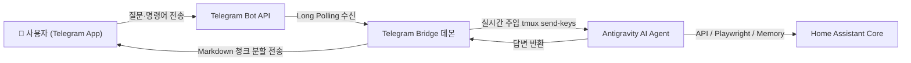

<p align="right">
  <strong>한국어</strong> · <a href="README.en.md">English</a>
</p>

<p align="center">
  
</p>

<h1 align="center">Antigravity for Home Assistant</h1>

<p align="center">
  Home Assistant 안에서 <strong>Google Antigravity AI CLI(<code>agy</code>)</strong> 및 <strong>Telegram Bot 메신저</strong>와 대화하며<br>
  스마트홈 제어, 대시보드 검증, 자동화 구축, 엔티티 정리 및 오류 해결을 수행하는 올인원 AI 어시스턴트 앱입니다.
</p>

<p align="center">
  <a href="https://github.com/Kanu-Coffee/antigravity-for-home-assistant/releases"></a>
  <a href="https://github.com/Kanu-Coffee/antigravity-for-home-assistant/actions/workflows/ci.yaml"></a>
  
  
  <a href="LICENSE"></a>
</p>

<p align="center">
  <a href="https://my.home-assistant.io/redirect/supervisor_add_addon_repository/?repository_url=https%3A%2F%2Fgithub.com%2FKanu-Coffee%2Fantigravity-for-home-assistant"></a>
</p>

---

## 🌟 주요 특징

- 🤖 **Native Google Antigravity CLI (`agy`) 탑재**: Google DeepMind 팀이 개발한 강력한 AI 코딩 & 시스템 제어 에이전트 내장.
- 📱 **Telegram Bot 모바일 원격 제어 (3종 간편 연동)**: 1-Click 딥링크 클릭, 6자리 핀 코드 입력, 수동 Chat ID 등록 중 원하는 방식으로 어디서나 스마트폰으로 대화.
- 🧠 **`ha_memory` 지속성 지식 메모리 DB (16개 도구)**: 집안의 구조, 사용자 선호도, 디바이스 별칭 및 자동화 규칙을 SQLite 메모리에 안전하게 기억.
- 🌐 **`playwright` 대시보드 브라우저 검증 MCP (16개 도구)**: Headless Chromium을 이용해 Ingress 웹 UI 대시보드 스냅샷 및 렌더링 검사 자동 수행.
- 🛡️ **HAOS 특화 안전 가이드라인 (`AGENTS.md`)**: `secrets.yaml`, `.storage` 보안 보호 및 YAML 수정 전후 `ha-config-check` 검증 의무화.
- ⚡ **실시간 `tmux` 세션 동기화**: 웹 터미널(`ttyd`)과 텔레그램 봇 간의 인증 및 대화 컨텍스트 실시간 공유.

---

## 📱 Telegram Bot 모바일 연동 가이드

텔레그램 메신저를 통해 모바일이나 외출 중에도 Antigravity AI에게 말을 걸고 집안 상태를 확인하거나 제어할 수 있습니다.



### 1단계: Telegram 봇 토큰 발급 (10초 소요)
1. 텔레그램 앱에서 **[@BotFather](https://t.me/botfather)** 검색 후 대화 시작 (`/start`)
2. `/newbot` 입력 후 봇 이름 및 봇 사용자 이름(Username, 끝이 `bot`으로 끝남) 지정
3. 생성 완료 후 발급되는 **HTTP API Token** (예: `123456789:ABCdefGhIJKlmNoPQRsTUVwxyZ`) 복사

### 2단계: Home Assistant 애드온 설정 등록
1. Home Assistant **[설정] ➔ [애드온] ➔ [Antigravity for Home Assistant]** 이동
2. **구성 (Configuration)** 탭 클릭
3. `telegram_enabled`: **`true`** 체크
4. `telegram_bot_token`: 복사한 봇 토큰 붙여넣기 ➔ **저장** 후 **애드온 재시작**

### 3단계: 3가지 중 원하는 방식으로 원클릭 연동 완료!

| 연동 방식 | 연동 방법 (아래 3가지 중 편한 것 선택) | 추천 대상 |
|---|---|---|
| **1. 1-Click Deep Link (추천)** | 애드온 로그에 뜬 `🔗 https://t.me/YourBot?start=PAIR_xxxx` 링크를 클릭하면 텔레그램 앱이 열리며 **1초 만에 자동 승인** | **가장 빠르고 간편함** |
| **2. 6자리 PIN 코드** | 텔레그램 봇 대화창에 애드온 로그에 뜬 **6자리 핀 번호(예: `702-215`)**를 메시지로 입력 | **스마트폰 앱에서 직접 입력 시** |
| **3. 수동 Chat ID 등록** | 애드온 설정 탭의 `telegram_allowed_chat_ids`에 자신의 숫자 Chat ID 직접 입력 | **수동 관리 선호 시** |

---

## 💬 텔레그램 및 터미널 사용 예시

연동이 완료되면 텔레그램이나 웹 터미널에서 일반 대화하듯 자유롭게 질문하시면 됩니다!

### 💡 스마트홈 제어 및 상태 확인
- *"거실 조명 켜줘"*
- *"현재 집안에 켜져 있는 기기 목록과 에어컨 온도 알려줘"*
- *"안방 공기청정기 필터 상태 확인해줘"*

### ⚙️ 자동화 및 YAML 설정 작성
- *"오후 11시 이후에 거실 모션이 감지되면 복도 조명을 20% 밝기로 켜는 자동화 만들어줘"*
- *"현재 automations.yaml 문법에 오류가 없는지 ha-config-check로 점검해줘"*

### 🧠 지속성 메모리 및 사용자 선호도 기억 (`ha_memory`)
- *"우리 집 거실 공기청정기는 오후 10시 이후 항상 저소음 모드로 동작해야 해. 이 사실을 ha_memory에 기억해둬."*
- *"기억해둔 내 선호도를 바탕으로 밤 시간 자동화를 재구성해줘."*

### 📋 텔레그램 전용 명령어
- `/start` : 봇 환영 메시지 및 연동 상태 확인
- `/status` : Home Assistant Core API, Supervisor, YAML 설정 상태 실시간 리포트
- `/help` : 사용 도움말 표시
- `/unpair` : 현재 텔레그램 계정 연동 해제

---

## 🛠️ 내장 헬퍼 명령어 모음

웹 터미널(`ttyd`) 및 SSH 세션에서 사용할 수 있는 전용 헬퍼 도구입니다.

| 명령어 | 설명 |
|---|---|
| `agy` / `antigravity` | Google Antigravity AI CLI 대화형 세션 시작 |
| `ha-antigravity-login` | Google Account OAuth 2.0 헤드리스 브라우저 로그인 실행 |
| `ha-config-check` | Home Assistant Core YAML 구성 검사 수행 |
| `ha-core-logs` | Home Assistant Core 시스템 로그 확인 |
| `ha-addon-logs` | 설치된 애드온별 실시간 로그 스트리밍 |
| `ha-memory status` | `ha_memory` SQLite 데이터베이스 무결성 및 엔티티 카탈로그 현황 조회 |
| `ha-feedback` | 앱 버그 제보 및 기능 제안을 위한 자동화 리포트 도구 |

---

## 📦 5분 설치 가이드

### 요구사항
- Home Assistant OS 또는 Supervised 환경
- **amd64** 아키텍처 지원 기기
- Google 계정 (Antigravity CLI 인증용)

### 설치 방법
1. Home Assistant **[설정] ➔ [애드온] ➔ [애드온 스토어]**를 엽니다.
2. 우측 상단 `⋮` 메뉴 ➔ **저장소(Repositories)**에 아래 URL을 추가합니다:
   ```text
   https://github.com/Kanu-Coffee/antigravity-for-home-assistant
   ```
3. 저장소 목록에서 **Antigravity for Home Assistant**를 선택하고 **Install**을 누릅니다.
4. **OPEN WEB UI**를 눌러 웹 터미널을 열고, 최초 1회 로그인을 진행합니다:
   ```bash
   ha-antigravity-login
   ```
5. 화면에 나타나는 Google 인증 링크를 통해 권한을 부여하면 모든 설정이 완료됩니다!

---

## 📄 라이선스

본 프로젝트의 소스 코드는 [Apache License 2.0](LICENSE)으로 배포됩니다.
