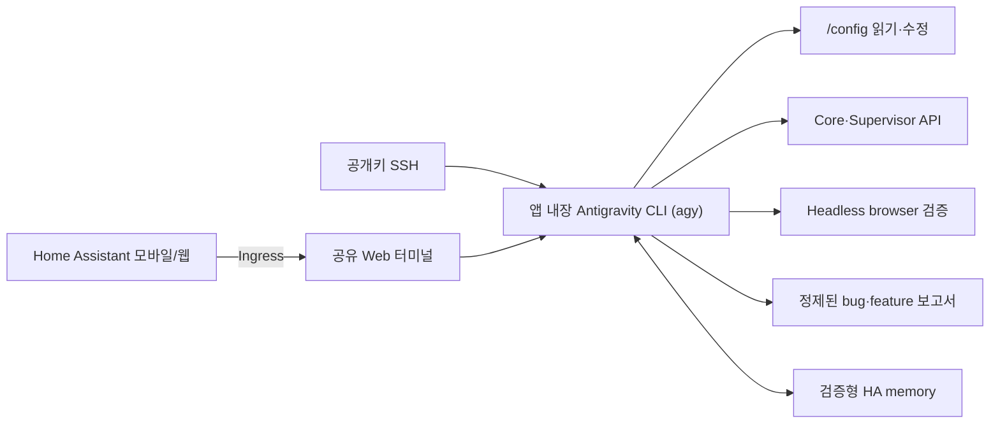

<p align="right">
  <strong>한국어</strong> · <a href="README.en.md">English</a>
</p>

<p align="center">
  
</p>

<h1 align="center">Antigravity for Home Assistant</h1>

<p align="center">
  Home Assistant 안에서 Google Antigravity CLI(`agy`)와 대화하며 설정을 살펴보고,<br>
  대시보드·자동화·엔티티·오류를 함께 정리하는 Home Assistant 앱입니다.
</p>

<p align="center">
  <a href="https://github.com/Kanu-Coffee/antigravity-for-home-assistant/releases"></a>
  <a href="https://github.com/Kanu-Coffee/antigravity-for-home-assistant/actions/workflows/ci.yaml"></a>
  
  
  <a href="LICENSE"></a>
</p>

<p align="center">
  <a href="https://my.home-assistant.io/redirect/supervisor_add_addon_repository/?repository_url=https%3A%2F%2Fgithub.com%2FKanu-Coffee%2Fantigravity-for-home-assistant"></a>
</p>

> [!WARNING]
> 이 앱은 `/config` 전체를 읽고 쓸 수 있고 Home Assistant Core 및 Supervisor `manager` API를 사용할 수 있는 강한 관리자 도구입니다. 중요한 변경 전에는 백업하고, 계획과 diff를 확인한 뒤 적용하세요. SSH 포트를 인터넷에 직접 공개하지 마세요.

비공식 커뮤니티 프로젝트이며 Google 또는 Home Assistant/Nabu Casa와 제휴하거나 보증받은 제품이 아닙니다. 현재는 **amd64 전용 experimental 릴리스**입니다.

## 무엇을 할 수 있나요?

| 하고 싶은 일 | Antigravity와 함께 하는 방식 |
| --- | --- |
| 모바일 대시보드 만들기 | 설치된 카드와 기존 대시보드를 조사하고, YAML 초안·diff를 만든 뒤 데스크톱/모바일 화면을 점검합니다. |
| 자동화 만들기 | 생활 패턴과 현재 엔티티를 바탕으로 후보를 제안하고, 승인한 항목만 구현·검증합니다. |
| 엔티티 정리하기 | 중복·미사용·참조 끊김 후보를 찾고 영향 범위를 보여 줍니다. 삭제나 registry 변경은 별도 확인 후 수행합니다. |
| 오류 원인 찾기 | 설정 파일, `ha-config-check`, Core/App 로그와 상태를 함께 살펴보고 최소 수정안을 제안합니다. |
| 앱 버그·개선 제보 준비하기 | `$ha-feedback`이 앱 범위만 읽기 전용으로 점검하고 환경·검사·미검증 범위를 정제된 보고서로 만든 뒤, 공개 전 최종 본문을 다시 확인받습니다. |
| Home Assistant 직접 작업하기 | `/config` 파일과 지원되는 Core/Supervisor API를 이용해 변경하고, 가능한 경우 fresh API로 결과를 다시 확인합니다. |
| 이동 중 이어서 작업하기 | Home Assistant 모바일 앱/웹의 Ingress 터미널을 사용하거나, SSH endpoint에 직접 연결합니다. |
| 집의 맥락 기억시키기 | HA 구조와 사용자가 명시한 별칭·용도·선호를 이 프로젝트의 검증형 로컬 메모리에 보존해 다음 작업에서 관련 정보만 찾습니다. |

## 작동 방식



- **Web UI**는 Home Assistant Ingress 안에서 열리는 `ttyd` + `tmux` 터미널입니다.
- **Antigravity CLI (`agy`)**는 `/config`에서 실행되며 설정 파일, helper 명령, API와 Headless Chromium을 함께 사용할 수 있습니다.
- **재접속**하면 같은 `tmux` 세션으로 돌아가므로 브라우저를 닫아도 앱이 실행 중인 동안 작업이 이어집니다.

## 5분 설치

### 요구사항

- Home Assistant OS 또는 Supervisor가 있는 설치 환경
- **amd64** 장치
- 인터넷 연결 및 Google Antigravity 계정/CLI 환경

### 설치와 첫 실행

1. App store의 **Repositories**에 다음 URL을 추가합니다.

   ```text
   https://github.com/Kanu-Coffee/antigravity-for-home-assistant
   ```

2. **Antigravity for Home Assistant**를 설치하고 시작합니다.
3. **OPEN WEB UI**를 누릅니다.
4. 처음 한 번 Antigravity CLI에 로그인합니다.

   ```bash
   ha-antigravity-login
   ```

5. Antigravity를 시작합니다.

   ```bash
   ha-antigravity
   ```

## 라이선스

프로젝트 소스는 [Apache License 2.0](LICENSE)으로 배포됩니다.
