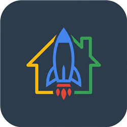

<p align="right">
  <strong>한국어</strong> · <a href="README.en.md">English</a>
</p>

<p align="center">
  
</p>

<h1 align="center">Antigravity for Home Assistant</h1>

<p align="center">
  Home Assistant 안에서 Google Antigravity CLI를 실행하고,<br>
  안전한 API·브라우저·메모리 도구와 Telegram으로 HAOS를 관리하는 실험 단계 App입니다.
</p>

<p align="center">
  <a href="https://github.com/Kanu-Coffee/antigravity-for-home-assistant/releases"></a>
  <a href="https://github.com/Kanu-Coffee/antigravity-for-home-assistant/actions/workflows/ci.yaml"></a>
  
  
  <a href="LICENSE"></a>
</p>

<p align="center">
  <a href="https://my.home-assistant.io/redirect/supervisor_add_addon_repository/?repository_url=https%3A%2F%2Fgithub.com%2FKanu-Coffee%2Fantigravity-for-home-assistant"></a>
</p>

> [!WARNING]
> 이 App은 `/config` 쓰기 권한과 Home Assistant Core·Supervisor 관리자급 API
> 권한을 사용합니다. 신뢰하는 관리자만 설치하고, 변경 전 백업과 preview를
> 확인하세요. 현재 `experimental`이며 실제 HAOS 양쪽 아키텍처의 전체 설치·업데이트·
> rollback 검증은 릴리스별 증거를 확인해야 합니다.

## v2가 제공하는 것

- 고정된 native Google Antigravity CLI와 `agy` 명령
- Home Assistant용 image-managed plugin, rules, skills, bounded read MCP
- `/config` 설정 검사, Core/App 로그, 제한된 Supervisor API helper
- read-only 관리형 사용자로 HA dashboard를 보는 headless Playwright MCP
- 명시적 사실과 검증된 후보만 보존하는 bounded HA memory
- `/config`와 전역 Antigravity 환경을 그대로 사용하는 비대화형 Telegram bridge
- requester·chat·preview digest·TTL에 묶인 승인 broker
- 항상 enforce되는 AppArmor와 선택형 민감정보 진단 read-only profile
- `amd64`와 `aarch64`용 GHCR prebuilt release image

## 빠른 설치

요구사항은 Supervisor가 있는 Home Assistant OS 또는 Supervised 환경, `amd64` 또는
`aarch64` 장치, 인터넷 연결, Antigravity를 사용할 Google 계정입니다. HACS로
설치하는 통합이 아닙니다.

1. Home Assistant에서 **설정 → Apps → App store → Repositories**를 엽니다.
2. 다음 저장소 URL을 추가합니다.

   ```text
   https://github.com/Kanu-Coffee/antigravity-for-home-assistant
   ```

3. **Antigravity for Home Assistant**를 설치하고 기본 설정으로 시작합니다.
   릴리스 App은 장치에서 소스를 빌드하지 않고
   `ghcr.io/kanu-coffee/antigravity-for-home-assistant`의 아키텍처별 이미지를
   받습니다.
4. **OPEN WEB UI**에서 최초 한 번 native OAuth를 시작합니다.

   ```bash
   ha-antigravity-login
   ```

5. CLI가 보여 주는 Google 인증 절차를 완료한 뒤 새 세션을 시작합니다.

   ```bash
   agy
   ```

`ha-antigravity-login`은 별도 로그인 subcommand를 흉내 내지 않고 controlling TTY에서
공식 Antigravity first-run OAuth를 실행합니다. OAuth 자료를 출력하거나 이슈에
첨부하지 마세요.

## Telegram 설정

> [!CAUTION]
> Telegram은 CLI와 동등한 **관리자 주 채널**입니다. 허용된 Telegram 사용자는
> `/data/home`, `/config`, native OAuth, 전역·workspace plugin/agent/rule/MCP와
> Antigravity 권한 정책을 그대로 사용하고 수정할 수 있습니다. bot token, 허용된
> chat과 Telegram 계정을 HA 관리자 credential처럼 보호하세요. 실제 HAOS의 통합
> OAuth·AppArmor·Bot API E2E는 릴리스 증거가 생기기 전까지 `NOT RUN`입니다.

Web UI 또는 SSH에서 `ha-antigravity-login`으로 공식 native first-run OAuth를 한 번
완료한 뒤 bot을 활성화합니다. 별도 Telegram identity, `ha-telegram-login`, 전용 HOME
bootstrap은 사용하지 않습니다.

[@BotFather](https://t.me/botfather)에서 bot token을 만든 뒤 다음 두 인증 방법 중
하나를 선택합니다.

### 정적 허용 목록

App 설정에 사용자 ID와 채팅 ID를 모두 넣습니다. 요청은 두 목록의 교집합에
포함될 때만 허용됩니다. 어느 한 목록만 채우면 인증되지 않습니다.

```yaml
telegram_enabled: true
telegram_bot_token: "REDACTED"
telegram_allowed_user_ids:
  - "123456789"
telegram_allowed_chat_ids:
  - "123456789"
```

### 로컬 일회용 pairing

Web UI 또는 SSH의 로컬 셸에서 token을 만들고 만료 전에 같은 bot에 전송합니다.

```bash
ha-telegram-pair create --ttl 5m
```

Telegram에서 `/start TOKEN`을 보냅니다. token은 한 번만 표시되고 한 번만 사용할
수 있으므로 비밀로 취급합니다. 승인 목록은 `ha-telegram-pair list`, 철회는
`ha-telegram-pair revoke AUTHORIZATION_ID`로 관리합니다. PIN, 자동 deep link,
`/unpair`는 v2 계약이 아닙니다.

Bot pairing은 관리자급 Antigravity 환경에 접근할 Telegram user/chat을 승인합니다.
`/start`, `/help`, `/status`, `/new`, `/cancel`은 AI prompt가 아니라 bridge가 직접
처리하는 로컬 제어 명령입니다. 최초 자연어 요청은 user/chat에 대화 session을 먼저
영속 결합하고 이후 요청과 승인·응답은 같은 session에서 직렬 처리합니다. 오직
명시적인 `/new`만 새 session으로 회전합니다. 로그인 필요 안내가 나오면 credential
파일을 찾거나 복사하지 말고 신뢰하는 App 터미널에서 `ha-antigravity-login`을
실행하세요.

Telegram을 먼저 활성화했더라도 bridge는 Bot API에 연결하지 않고
`waiting_for_authorization` 상태로 조용히 대기합니다. 같은 App 터미널에서 pairing을
생성하면 App을 재시작하지 않아도 이를 감지해 연결을 계속합니다.

### 공유 권한 정책

Telegram 전용 mode는 없습니다. Telegram은 Web/SSH와 같은
`antigravity_tool_permission`, `antigravity_terminal_sandbox`와
`antigravity_sensitive_data_access` 설정을 따릅니다. 2.0.6 이하의
`telegram_access_mode` 값은 권한으로 사용하지 않는 migration-only 입력입니다.
별도 사람 확인이 필요한 고위험 작업은 전역 tool policy로 낮출 수 없습니다.
bridge는 pipe된 stdin으로 질문을 받고 같은 `/data/home`과 `/config`에서 공유
`antigravity --output-format stream-json` launcher를 실행합니다. 별도 shell이나 공유
tmux에 입력을 주입하지 않지만 CLI와 같은 전역
설정·plugin·agent·rule·권한 정책을 상속합니다. 생성된 답변은 암호화된 영속 outbox에
기록한 뒤 Telegram 전송 확인 시 제거합니다. 429처럼 미전송이 명확한 오류만 bounded
backoff로 재시도하고 전달 여부가 모호하면 `/retry` 전까지 격리합니다.
1.1.13 `stream-json`이 native permission prompt 재개 protocol을 제공하지 않으므로,
관리형 HA 변경은 Telegram 승인 버튼을 사용하고 global allow 밖의 임의 tool 검토는
Web/SSH 또는 전역 permission 변경이 필요합니다. Telegram만의 auto-approve는 없습니다.

## 안전 기본값

- AppArmor는 항상 켜져 있으며 App 옵션으로 끌 수 없습니다.
- `antigravity_sensitive_data_access: false`가 기본값입니다. 이때 대화형
  Web/SSH/Telegram Antigravity도 `secrets.yaml`, `.storage`, Recorder DB를 읽거나
  쓸 수 없습니다.
- 값을 `true`로 바꾸면 Web/SSH/Telegram Antigravity child가 세 종류를 진단용으로
  읽을 수 있고 쓰기·이름 변경·삭제는 계속 거부됩니다.
- browser, memory, broker와 일반 shell에는 이 권한이 전달되지 않습니다.
- SSH private key, App token, backup, SSL private material, cloud auth는 두 설정 모두
  차단됩니다.
- `always-proceed`나 terminal sandbox 해제도 AppArmor와 Telegram broker 정책을
  우회하지 못합니다.
- Web/SSH/Telegram Antigravity는 의도적으로 `/data/home`의 OAuth와 사용자 설정,
  `/config` 프로젝트를 공유합니다. 따라서 Telegram prompt가 유도한 credential·설정
  접근과 정상 접근을 AppArmor만으로 구분할 수 없으며, 정확한 user/chat 인증과
  Telegram 계정 보호가 관리자 경계입니다.

SSH는 공개키만 허용합니다. TCP `2224`를 인터넷에 직접 노출하지 말고 신뢰하는
VPN을 사용하세요.

## 업데이트와 migration

`antigravity_user_files_update_mode`의 기본값은 `preserve`입니다.

| 값 | 동작 |
| --- | --- |
| `preserve` | OAuth와 사용자 소유 settings·MCP·plugin을 보존; App 소유 HA plugin은 version당 보안 갱신 |
| `refresh_managed` | 위 보존 원칙과 plugin 갱신에 더해 소유권이 기록된 settings key·permission rule을 backup 후 merge |
| `reset_v2` | 같은 managed settings merge를 엄격하게 수행하고 ownership이 없거나 모호하면 중단 |

`reset_v2`도 `/config`, OAuth, SSH key, browser identity, memory와 사용자 plugin을
초기화하지 않습니다. 소유권을 증명할 수 없으면 덮어쓰지 않고 중단합니다. 업데이트
mode와 관계없이 App 소유 `home-assistant` plugin은 안전한 ownership marker가 있을
때 App version당 한 번 canonical image copy로 갱신됩니다. 같은 이름의 marker 없는
plugin은 사용자 소유 충돌로 보고 시작을 중단합니다. 업데이트 전 Home Assistant
전체 backup과 현재 동작 version/image를 기록하고, 실패하면
`preserve`로 되돌린 뒤 이전 immutable version과 검증된 scoped backup으로
복구하세요. 자동 HAOS rollback은 보장하지 않습니다.

## 문서와 검증 상태

- [한국어 App 사용 설명서](antigravity_home_assistant/DOCS.md)
- [English App user guide](antigravity_home_assistant/DOCS.en.md)
- [v2 개발 계약과 체크리스트](docs/v2/README.md)
- [릴리스와 변경 이력](antigravity_home_assistant/CHANGELOG.md)

저장소 테스트는 native CLI 계약, Telegram broker, read broker, memory, browser,
migration과 AppArmor 정책을 검사합니다. 그러나 generic Linux의 parse/build 성공은
실제 HAOS AppArmor enforce나 양쪽 아키텍처 runtime 성공의 대체 증거가 아닙니다.
설치 전 해당 릴리스의 CI, GHCR multi-arch manifest와 HAOS 검증 기록을 확인하세요.

## 라이선스

[Apache License 2.0](LICENSE)
